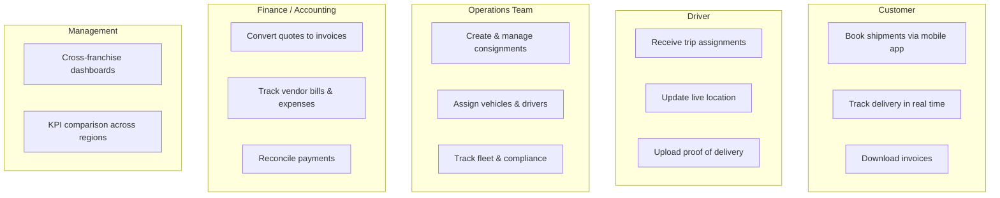
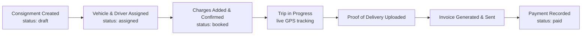
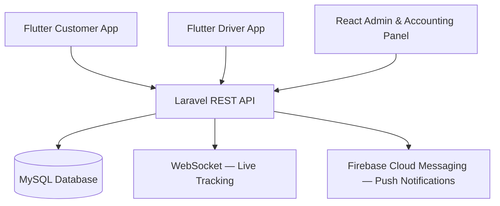

# Peak Logistics — Business Case Study
### A Business Analyst's Read of an International Logistics Management System

## Table of Contents

- [Executive Summary](#1-executive-summary)
- [Business Problem](#2-business-problem)
- [Stakeholder Analysis](#3-stakeholder-analysis)
- [Requirements](#4-requirements)
- [Process: As-Is vs To-Be](#5-process-as-is-vs-to-be-consignment-lifecycle)
- [Delivery Approach](#6-delivery-approach)
- [My Contribution — Accounting Panel](#7-my-contribution--accounting-panel)
- [Outcomes & What I'd Measure Next](#8-outcomes--what-id-measure-next)
- [Architecture Overview](#9-architecture-overview)
- [Tech Stack](#10-tech-stack-for-reference)
- [Key Skills Demonstrated](#11-key-skills-demonstrated)
- [Disclaimer](#disclaimer)
- [Contact](#contact)

---

> **Note on this document:** I worked on Peak Logistics as a backend development intern, building the Accounting Panel module. This case study re-examines that same project through a **business analyst lens** — the problem it solves, the stakeholders it serves, the requirements behind it, and the trade-offs the team made — as a demonstration of the analytical thinking I bring to a Junior Business Analyst role. Technical details are included only where they support a business point.

---

## 1. Executive Summary

Peak Logistics is a multi-platform freight and logistics management system built for freight forwarding companies operating across **Qatar, Saudi Arabia, and the UAE**. It replaces fragmented, manual coordination between operations, accounting, and customer service with a single platform that spans a web admin panel, an accounting panel, and mobile apps for customers and drivers.

| | |
|---|---|
| **Domain** | Freight & Logistics (GCC region) |
| **Users** | Customers, Drivers, Operations Admins, Accountants, Management |
| **Regions** | Qatar (QAR), Saudi Arabia (SAR), UAE (AED) — separate currency & tax rules per franchise |
| **My module** | Accounting Panel (invoicing, payments, expenses, ledger, tax, reporting) |
| **Delivery approach** | Agile, 8 sprints over 16 weeks |

---

## 2. Business Problem

Freight companies in the GCC region were commonly running operations across three fragmented layers: paper/WhatsApp-based coordination, spreadsheets for finance, and manual phone calls for status updates. This created five concrete problems:

| # | Problem | Business Impact |
|---|---|---|
| 1 | **Operational fragmentation** — consignment creation, vehicle/driver assignment, invoicing, and delivery confirmation lived in separate, disconnected tools | Duplicated data entry, frequent errors |
| 2 | **No multi-franchise coordination** — branches in 3 countries couldn't be managed, or reported on, from one place | No cross-region visibility for management |
| 3 | **Manual invoicing** — quotes/invoices/expenses tracked in spreadsheets | Revenue leakage, delayed billing |
| 4 | **No real-time visibility** — no way to see vehicle/driver/shipment status without a phone call | Poor customer experience, ops overhead |
| 5 | **Driver compliance risk** — license/passport/insurance expiry tracked manually | Legal and financial exposure in a regulated market |

**Why it matters:** the GCC logistics sector is worth hundreds of billions of dollars, and even a 10–15% efficiency gain (fewer manual errors, faster invoicing, better utilization) is a meaningful financial outcome for an operator — which is the commercial case for building this system at all.

---

## 3. Stakeholder Analysis

Understanding *who* needs what was central to how the system was scoped. Five distinct stakeholder groups, each with different needs:

| Stakeholder | Core Need | Feature Delivered |
|---|---|---|
| Customer | Self-service booking & visibility | Mobile app, live tracking, push notifications |
| Driver | Simple, mobile-first task flow | Trip assignment app, GPS updates, POD upload |
| Operations | Structured, error-proof workflow | 3-step consignment creation, vehicle/driver allocation |
| Finance | Single source of financial truth | Accounting Panel (invoices, payments, expenses, ledger, tax) |
| Management | Cross-region performance visibility | Reporting & analytics dashboards |
| Compliance/Legal | Reduce regulatory exposure | Automated KYC + document expiry alerts |

---

## 4. Requirements

### 4.1 Key Functional Requirements
- Structured **3-step consignment workflow**: *Details → Freight Assignment → Charges*, with hard validation gates (a user cannot reach Step 2 without completing Step 1)
- **Multi-franchise data isolation**: independent currencies, tax rates, and document numbering per country, on one shared codebase
- **Driver KYC workflow** with approval states and automated expiry alerts for license, passport, residence ID, and insurance
- **Quote-to-invoice conversion**, vendor bill tracking, and per-franchise expense categorization
- **Role-based access control** so staff only see the functions relevant to their job
- **Real-time tracking** (GPS + WebSocket) and **push notifications** (FCM) for status changes

### 4.2 Non-Functional Requirements
- Secure, token-based mobile authentication (Laravel Sanctum) for customer/driver apps
- Auditability of every financial transaction (immutable ledger with running balance)
- Scalability to support additional franchises/regions without re-architecture

### 4.3 A Requirements Lesson Worth Naming
Partway through development, some modules were built on assumptions **before requirements were fully finalized** — for example, invoice status handling was built without an agreed "draft" state, and the Accounting modules were initially treated as independent of the rest of the system, which caused integration issues later.

Both were fixed — the first through a scoping conversation that led to adding a formal draft status; the second by mapping entity relationships explicitly (ER diagram) and resequencing development so dependent modules were built in the right order. The broader lesson: **ambiguous requirements cost more the later they're caught**, which is exactly the gap a business analyst is there to close before development starts.

---

## 5. Process: As-Is vs To-Be (Consignment Lifecycle)

Each stage enforces a status transition, and the system will not allow a step to be skipped — which is what closes the "fragmented tools, duplicated effort" gap identified in the problem statement.

---

## 6. Delivery Approach

The team used **Agile (8 sprints, 16 weeks)** rather than Waterfall. From a BA/planning standpoint, this was the right call for three reasons specific to this project:

1. **14+ interdependent modules** — building everything at once (Waterfall) meant a single mistake in one module (e.g. Consignment) would ripple into every module built after it.
2. **Requirements evolved mid-project** — features like the driver "Conversion Request" and an accounting "Manual Journal" entry were added after development had started; Agile absorbed that, Waterfall would not have.
3. **Four distinct user types** (Admin, Accountant, Customer, Driver) — sprinting let the team fully validate one user type's workflow before moving to the next, rather than guessing at all four simultaneously.

| Sprint | Focus | Key Deliverable |
|---|---|---|
| 1–2 | Auth, region/franchise selection | Working login with region isolation |
| 3–4 | Consignment creation (Steps 1–3) | End-to-end consignment + invoice |
| 5–6 | Driver, vehicle, KYC | Compliance workflow live |
| 7–8 | Mobile APIs, tracking, notifications, Accounting Panel | Full system integration |

---

## 7. My Contribution — Accounting Panel

I owned backend design and development for the financial core of the system:

| Module | What It Does | Business Purpose |
|---|---|---|
| **Invoice Management** | Invoice lifecycle: Draft → Sent → Paid/Overdue, linked to shipments | Removes manual invoice tracking in spreadsheets |
| **Payment Tracking** | Records payments against invoices; auto-updates invoice status on full payment | Gives finance a real-time view of what's actually been collected |
| **Expense Management** | Category-tagged expense tracking (fuel, maintenance, salary, etc.) | Enables per-franchise cost visibility |
| **Transaction Ledger** | Chronological, running-balance record of every credit/debit | Full auditability of the money moving through the system |
| **Tax/GST Engine** | Applies region-specific tax rates to invoices automatically | Handles QAR/SAR/AED tax rules without manual calculation |
| **Reports** | Monthly revenue, expense-vs-income, outstanding payments, exportable ledger | Gives management the data to compare profitability by route, customer, or region |

**Why this matters for a BA role:** this module exists because Finance told Operations "we can't tell what we've actually been paid, and we're closing the books manually" — translating that pain point into a data model (invoices → payments → transactions → reports) and a set of business rules (a payment can't exceed its invoice, an invoice auto-closes once fully paid) is requirements analysis and process design work, even though it shipped as backend code.

---

## 8. Outcomes & What I'd Measure Next

The problems named in Section 2 map directly to measurable outcomes this kind of system should move:

- **Invoice cycle time** (consignment delivered → invoice sent) — should shrink from days to hours
- **% of drivers with expired documents** — should trend toward zero with automated alerts vs. manual tracking
- **Revenue leakage** — reduced by removing spreadsheet-based invoicing and manual expense entry
- **Cross-franchise reporting time** — from "manually compiling 3 sets of spreadsheets" to one dashboard

If I were scoping the next phase as a BA, I'd want to validate these with actual usage data (invoice turnaround before/after, compliance alert response time) rather than assume the system delivers them — that's the natural next step past "build it" into "prove it worked."

---

## 9. Architecture Overview

A single Laravel REST API sits at the center, serving two mobile apps (customer, driver) and one web panel (admin/accounting), all backed by one MySQL database — this is what makes the multi-franchise, multi-user-type model possible without maintaining separate systems per region.

---

## 10. Tech Stack (for reference)

`Laravel` (backend) · `MySQL` (database) · `React.js` (admin/accounting web) · `Flutter` (customer & driver apps) · `WebSocket` (live tracking) · `Firebase Cloud Messaging` (push notifications) · `Laravel Sanctum` (mobile API auth)

---

## 11. Key Skills Demonstrated

- Business Requirement Analysis
- Stakeholder Analysis
- Process Mapping
- REST API Development
- Database Design
- Laravel Backend Development
- Agile Methodology
- Team Collaboration

---

## Disclaimer

This repository is intended for portfolio purposes only. It contains a case study describing my contributions during my internship. Proprietary source code, confidential business information, and company assets are not included.

---

## Contact

**Mansi Marathe**

- LinkedIn: (your LinkedIn URL)
- Portfolio: [mansimarathe.framer.website](https://mansimarathe.framer.website/)
- Email: (your email)

---

*This case study was written as a portfolio piece to demonstrate business analysis thinking — problem framing, stakeholder mapping, requirements analysis, and process design — applied to a real project I contributed to as a developer.*
